# Book Now Online Hotel Booking System

Tools and Tech used  :   Android studio, Java,  Firebase database. 

Code Link: [**https://github.com/perlasaicharanreddy/AndroidappDevelopment/tree/master/HotelBooking** ](https://github.com/perlasaicharanreddy/AndroidappDevelopment/tree/master/HotelBooking)

Android apk link: [**https://drive.google.com/file/d/1GEs6tPI88h7Hkg_N5X1qEXSu8PGxe8bW/view?usp=sharing** ](https://drive.google.com/file/d/1GEs6tPI88h7Hkg_N5X1qEXSu8PGxe8bW/view?usp=sharing)

**1.Abstract** 

This is an online hotel booking system designed using android studio and Firebase database. This app helps the user reserve the hotel room of customer choice online. 

This app facilitates the end user to view the hotel and hotel rooms based on the various categories and sorting preferences they select. It also lets the users register to the app so that individual profile can be maintained. User can access and modify user profile by signing in. New users are given sign up option. 

The user account maintains the personal details of the customer, both billing and room preference of the customer. Also, the reservation User has made can be viewed in the bookings module. The user can cancel reservation. 

If the user is business owner, then User can add business to the mybooking app and manage business profile so customer can view rooms provided by them. Also, hotel owner can add and update business information along with amenities provided and picture of service. Price can be managed by the hotel owner based on their business models and services provided by them. 

The system admin can manage app. Admin can manage user and agents(business owner ) accounts . he can also remove any user or agent account if he wish. 

**2.Introduction** 

With the ever expanding use of the internet and online travel booking sites for vacation planning, opportunities may exist for niche travel reservation offerings in the Online Travel Agency industry. My booking app is a new app developed to provide an online travel reservation service, specialized in Hotel room reservation services. The app plans to offer hotel accommodation service distribution for many types of hotel properties, from small independent hotels to five star luxury residences worldwide. 

Mybooking app is an efficient, informative, and user-friendly android application for leisure travelers to book reservations for their holiday vacations. Travelers will be able to easily make accommodation reservations, for a vast range of hotel rooms and vacation home properties worldwide, at very competitive rates. The service will also provide a more competitive distribution channel for hotels and resorts to make their accommodation products available to a targeted customer base. This app will greatly simplify the process of finding the most suitable accommodations for this more specialized traveler group, while providing hotels and other accommodation suppliers with a more cost effective distribution channel for their product. 

**3.Problem Description** 

The current manual reservation system uses paper and direct human interaction to book the hotel room and manage reservations. This makes delays exchanging of information in the hotel. Reservation is done via phone calls or by visit in person to the hotel reservation office. The guest’s personal details such as Name, gender, Age and Duration of visit or stay, are entered during booking made. Then the booking officer asks to prepare room for guest before customer check in date. The data and documents are transferred manually to the appropriate office for compilation of the guest’s file. On the day of check in date the file is transferred to the reception. On the day of checking in the guest is given the key to his room, customer also specify if room service is needed. 

The  Front  desk  hands  over  the  customers  file  to  the  account  department  where  guest  pays  for accommodation and other fee. The customers file is updated on daily basis of his expenditure costs. The financial department generates the bills on and delivered to the customer in their rooms. The guest pays at the accounts department. 

A day before their check out day, their expenditure are generated. The guests receive their expenditure at the accounts office as they check out, where they pay for remaining balance if any. 

After analyzed various traditional hotel room booking system, I had noticed the below problems in their system.Manual system for storing records is not consistent as some inaccuracy can creep in while writing records manually. 

- Guest or visitors may face hard time to getting place to stay in area. 
- It is difficult to store record of availability of room and huge number of customer’s records. 
- More manpower is required and the current system consumes too much time to making reservation and storing data. 
- Maintaining of up to date availability of inventory is bit difficult, thus, it is making hard for executive to search the particular records and room. 
- Payment processing and collection is difficult. 
- Inaccurate of records or data. 
- There is no centralized database can be created as information not at one place. 
- More money and paper and other resources are wasted to store the record of available rooms and customers 

**Disadvantages of the manual System** 

- There is maximum possibility of losing customers record and files or mix up customer’s record. 
- As we are not sure and we can to re use past records, unwanted duplication of information and data is possible. 
- As the actual file is available, there are chances that one can use the files and information whiteout permission or right. 
- Maintaining file security and standard is difficult 
- As very easy access to guest information by unintended users, guest information is extremely unconfidential. 
- Reusing or retrieves of guest records is extremely difficult. 
- Human are required to fill forms and enter data, manual data entry leaves to errors. 

4. **Objective** 
- With this app Customers can easily go online with their mobile phones or tablets to browse about hotels within their vicinity. 
- Guests can be able to book for rooms within their budgets after seeing and accessing these hotels within their vicinity. 
- Receptionists can easily access customer’s information online without delay or with little delay. 
- Fraud done by the receptionist by not registering every customer will not occur because the customers details will be online and can be accessed by the managers too. 

5. **Scope** 

This project is aimed at developing an online application for hotel reservation. This system can be used by end users (Customer and hotel owners i.e agents) and administrator to perform extensible tasks, to reserve and sale hotel room in an easy and secure manner. The following facilities have been implemented : 

- Secure registration and profile management facilities for customers. 
- Adequate searching mechanisms for easy and quick access to particular hotel room and services. 
- Reserving the room and payment. 

In  addition  to  the  above  mentioned  basic  functional  requirements  for  the  project,  the  following supplementary requirements as well. I have created app navigation so that the customers can search for rooms and reserve or save to their account to reserve it later. A sorting mechanism for rooms by city. Module for a contact mechanism for the rooms from the customers has also been implemented. 

6. **Application Screenshots** 

**Login page** 

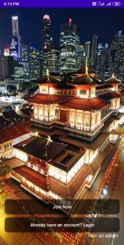 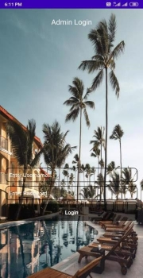

**Agent  Home** 

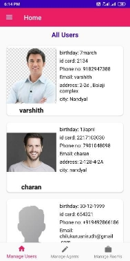 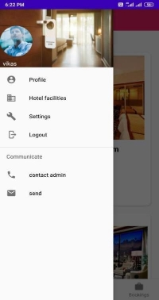

**User Home page** 

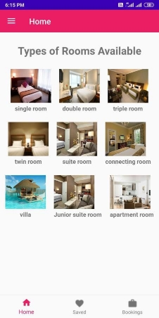 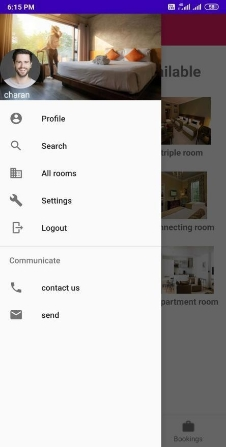

**Hotel room Pages** 

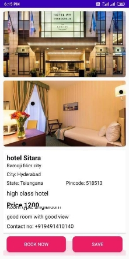 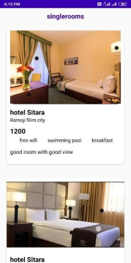

**Payment Page** 

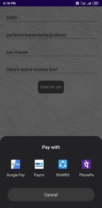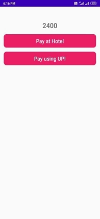

**User Profile** 
  

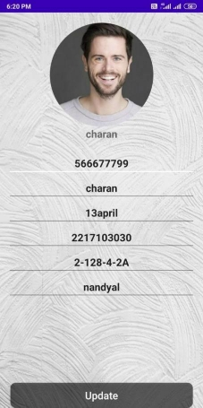

7. **Root Database structure** 

**8. Directory Structure** 

**9.Activities Created in Project** 

 

**10.Conclusion** 

The Online Hotel Reservation System was developed to replace the manual process of booking for a hotel room or any other facility of the hotel. The old system does not serve the customer in a better way; rather it makes customer data vulnerable. The new system keeps proper records of customers for emergency and security purposes. The hotel’s advertising effort is now accompanied by a virtual tour created on the system. 

With this online hotel booking system Customers can easily go online with their mobile phones or tablets to browse about hotels within their vicinity. Guests can be able to book for rooms within their budgets after seeing and accessing these hotels within their vicinity. Receptionists can easily access customer’s information online without delay. Thus it simplifies complicated work into simple and easy way through this app. 

**11.References** 

Youtube : <https://www.youtube.com/watch?v=6keVIot98QU&list=PLxefhmF0pcPlqmH_VfWneUjfuqhreUz-O>

Udemy: <https://www.udemy.com/course/the-complete-android-oreo-developer-course/>

Stack overflow: [ https://stackoverflow.com/](https://stackoverflow.com/)
 
